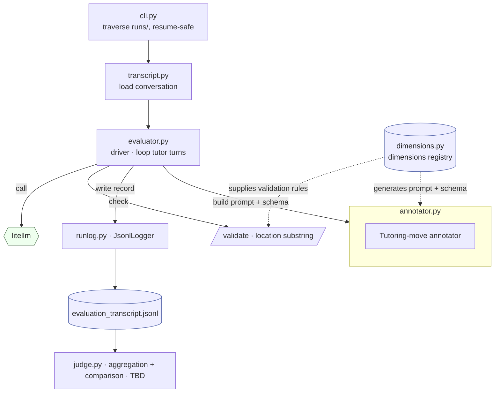

# Tutor/Student Conversation Evaluation 

This is a specification for the evaluation pipeline of tutor/student conversation. 


## Modules

The evaluator lives in `src/tutoring_check/evaluation/`. The annotator's prompts and response schema are generated from the dimension registry so they cannot drift from it; the same registry's rules are reused to validate each response.



`dimensions.py` and `transcript.py` are leaves; `annotator.py` builds on both; `evaluator.py` is the driver; `judge.py` is a later stage that aggregates across turns.


## Inputs and Outputs

The evaluator consumes the simulator's output. It does not re-run a conversation. For each conversation, it reads `transcript.jsonl`, which has data on the `scenario-id`, `scenario-type` (CI or CD), `region`, and `language`. 
Only the tutor turns (utterances) are scored (`speaker == tutor`). Student turns with dynamic state labels are read for context but are not scored.

The output is wrtten in the same simulation directory, alongside `transcript.jsonl`. The evaluation is resume-safe, where if `evaluation_transcript.jsonl` already exists, the evaluation is skipped. 
Additionally, there will be `evaluation_requests` and `evaulation_responses`, the raw API calls for audit, exactly like the simulator logs.


## Schema

Here is the header schema for `evaluation_transcript.jsonl`.
```
# header
{ "timestamp": ...,
  "scenario_id": ..., 
  "scenario_type": "CI|CD",
  "region": ...,
  "language": ...,
  "annotator_model": ...,
  "tutor_model": ...,            # copied from the transcript
  "transcript_path": ... }
```


## Dimensions

The dimensions are a set of countable tutor moves, organized as leaves under parent categories. The leaves (keyed in parentheses) are the move vocabulary. Each leaf lists the utterances that illustrate it — examples (that count) and, where useful, non-examples (near-misses that don't):

1. Checking Understanding — questions that surface what the student knows or believes.
   1.1 Comprehension Check (`comprehension_check`): probes recall of a definition or basic comprehension.
   - "What does 'velocity' mean?" — directly probing recall of a definition.
   - "Can you tell me what the variables mean in this equation?" — checking basic comprehension.
   - "How has the temperature changed?" — checking solving skills.
   1.2 Eliciting Reasoning/Justification (`eliciting_reasoning`): asks the student to justify or reason through a specific claim.
   - "Elaborating on the 'tusk-hunting cultures' you mentioned, how have elephants adapted?" — asking them to justify a specific claim.
   - "Why do you think the volume of the liquid expanded?" — probing the reasoning behind a claim made by the teacher or student.
   1.3 Eliciting Application of Knowledge (`eliciting_application`): asks the student to apply or transfer a concept to a new context.
   - "Can you give me an example of where you'd use the Pythagorean theorem in real life?" — asking them to apply a concept.
   - "Where else have you seen fractions show up outside of math class?" — prompting transfer to new contexts.
2. Scaffolding — information or structure to help the student progress.
   2.1 Hinting (`hinting`): partial guidance or a directional nudge that stops short of solving it.
   - "Think about what happens to the equation if you move everything to one side." — directional nudge but doesn't solve it.
   - "For the next step, what do you notice about the two denominators?" — draws attention to a feature and prompts the next step.
   2.2 Explaining (`explaining`): direct instruction, elaboration, worked example, or analogy.
   - "So the equals sign means both sides have to stay balanced, like a scale. Whatever you do to one side, you do to the other." — analogy.
   - "Actually, X-rays and gamma rays differ in frequency." — direct explanation.
3. Metacognitive Prompting — asks the student to reflect on or plan their own thinking or process, not the content itself.
   3.1 Planning Ahead (`planning_ahead`): asks the student to plan or think ahead about their approach before acting.
   - "Explain how you will set up that equation." — asking student to plan their process out loud.
   - "Before you start, what's your plan for tackling this problem?" — prompting the student to plan ahead.
   - [Doesn't count] "Explain your thinking." — eliciting reasoning about their response, not reasoning about their thinking.
   3.2 Reflecting Back (`reflecting_back`): asks the student to reflect back on their thinking, choices, or process after the fact.
   - "What made you decide to use subtraction there?" — reflecting on a choice already made.
   - "Looking back, what would you do differently next time?" — reflecting on their own process after the fact.
   - [Doesn't count] "Explain your thinking." — eliciting reasoning about their response, not reasoning about their thinking.
4. Affective Support — responding to the student's emotional or motivational state.
   4.1 Positive Encouragement (`positive_encouragement`): explicit affirmation of the student's thinking, effort, or progress.
   - "That's a strong connection!" — positive affirmation of their thinking.
   - "I can see how hard you've been working on this, and it's paying off." — acknowledging effort and progress.
   4.2 Neutral Acknowledgment (`neutral_acknowledgment`): validates the experience without cheerleading, including naming a misconception as common.
   - "I hear you — that part does feel confusing." — validating the experience without cheerleading.
   - "That's a very common thought." — acknowledging their misconception.
5. Personalized Contextualization — framing a concept using a scenario, context, or reference drawn from this specific student's known region, background, or interests.
   5.1 Cultural/Regional Grounding (`cultural_regional_grounding`): grounds the concept in the student's cultural or regional context.
   - "Imagine making 10 empanadas, and your friend ate 3 of them." — frames the problem around a food tied to the student's background.
   - "If you must pay a 18% tip on top of a 10% tax, how much additional cost did you have to pay?" — tipping and tax norms vary by region, so this frames the problem around the student's regional context.

A move is tagged only when its behavior, as described above, is exhibited on the turn. The moves are not mutually exclusive: a turn may carry several, but at most one instance of any given move.


## The annotator

Each utterance (tutor message) is evaluated by a single annotator model. It must differ from both the tutor model under test and the student model, to avoid self-serving bias. Its model id and params (seed, temperature) are recorded in the evaluation header for reproducibility.

The annotator sees the full transcript and reads it turn-by-turn. For each tutor turn, the whole conversation is rendered once with that target turn marked, and the annotator labels the marked turn only.

The annotator reads the transcript in the original language. Regardless of the transcript's language, the `reasoning` fields are written in English, so an analyst can review uniformly.


## Move identification

The annotator executes move identification. The dimension leaves above are the move vocabulary. For the marked turn, the annotator tags which moves occur and omits the rest exactly as in an example per-utterance prompt from the National Tutoring Observatory's RND. Each tagged move records a `location` (a verbatim substring of the turn) and a `reasoning` in English.

In this mode, the per-tutor-turn record is a list of tagged moves:

```
{ "timestamp": ...,
  "turn_id": <int>,
  "moves": [
     { "move": "<dimension_key>",                    # one of the dimension leaf keys
       "location": "<quote>",                        # exact substring of the tutor turn
       "reasoning": ...                              # English
     }, ... ] }
```

## Location and reasoning

`location` is a verbatim quote, an exact substring copied from the tutor turn, so it can be found back in the text with a string search. Every tagged move records one, pointing to where the move occurred.

`reasoning` is recorded for every tagged move, in English. It is an audit and aid for prompt-iteration and not a score.


## Validation (TBD)

Annotator tags are temporary until validated against a human-labeled sample.

The validation is TBD. When built, it compares the annotator's tagged moves to human labels on the same move set, checks agreement separately per language, and only trusts a move's tags once agreement is good enough. The agreement metric and the threshold are also TBD.


## The judge: aggregation and comparison (TBD)

Where the annotator emits per-turn move tags, the judge is the deterministic step that consumes those tags and computes the rollups and comparisons below. The following is TBD and are implementation suggestions:

1. Turn aggregation to conversation.
2. Conversation aggregation to condition.
   A condition (scenario × tutor model × language) is run `repeats` times, producing one conversation each. Average the per-conversation presence rates across those repeats and report a spread (e.g. std, bootstrap CI).
3. Condition comparison. Compare across the headline axes (tutor model × language).

On a fixed model, the languages will vary and be compared. On a fixed language, the models will vary and be compared.

