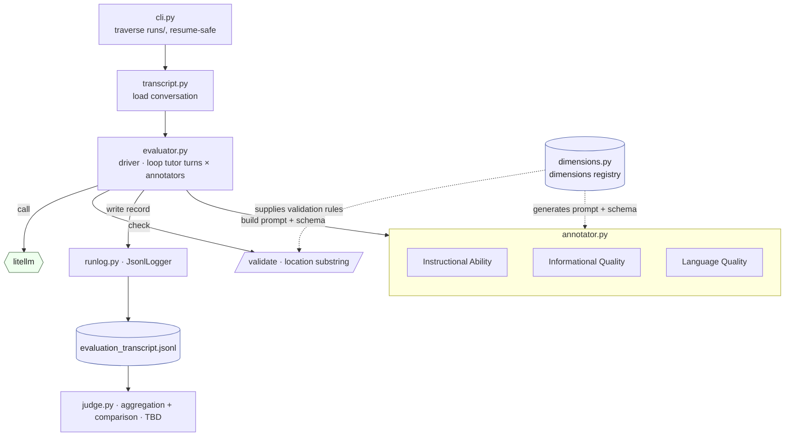

# Tutor/Student Conversation Evaluation 

This is a specification for the evaluation pipeline of tutor/student conversation. 


## Modules

The evaluator lives in `src/tutoring_check/evaluation/`. The annotator's prompts and response schema are generated from the dimension registry so they cannot drift from it; the same registry's rules are reused to validate each response.



`dimensions.py` and `transcript.py` are leaves; `annotator.py` builds on both; `evaluator.py` is the driver; `judge.py` is a later stage that aggregates across turns.


## Inputs and Outputs

The evaluator consumes the simulator's output. It does not re-run a conversation. For each conversation, it reads `transcript.jsonl`, which has data on the `scenario-id`, `scenario-type` (CI or CD), `region`, and `language`. 
Only the tutor turns (utterances) are scored (`speaker == tutor`). Student turns with dynamic state labels are read for context but are not scored.

The output is wrtten in the same simulation directory, alongside `transcript.jsonl`. The evaluation is resume-safe, where if `evaluation_transcript.jsonl` already exists, the evaluation is skipped. 
Additionally, there will be `evaluation_requests` and `evaulation_responses`, the raw API calls for audit, exactly like the simulator logs.


## Schema

Here is the header schema for `evaluation_transcript.jsonl`.
```
# header
{ "timestamp": ...,
  "scenario_id": ..., 
  "scenario_type": "CI|CD",
  "region": ...,
  "language": ...,
  "annotator_model": ...,
  "tutor_model": ...,            # copied from the transcript
  "transcript_path": ... }
```


## Dimensions

Here are framework dimensions for mTeach, an evaluation framework. 
mTeach has 3 categories of dimensions (instructional ability, informational quality, and langauge quality). The dimensions are below in detail:

Instructional Ability (from LearnLM):
1. Manage Cognitive Load (Explains the underlying concepts or skills in a clear way that is easy for the student to understand.)
2. Encourage Active Learning (Keeps the student actively participating (for example, through questions  or practice problems that the student has to answer). Guides student to an answer with appropriate steps.)
3. Deepen Metacognition (Provides clear feedback identifying any mistakes made by the student.  Provides clear feedback pointing out “successes” by the student (for example, on the student’s skills, problem-solving, work, knowledge, etc.)) 
4. Motivate and Stimulate Curiosity (Inspires and stimulates the interest or curiosity of the student. Monitors the student’s motivational state and adjusts responses accordingly.) Delivers feedback (whether positive or negative) in an encouraging way.
5. Adapt to Learners’ Goals and Needs (Identifies the student’s goal or prior knowledge).


Informational Quality (adapted from Wang and Strong's dimensions):

1. Intrinsic DQ (Believability, Objectivity, Accuracy, Reputation)
2. Contextual DQ (Value-added, Relevancy, Timelessness, Completeness, Appropriate amount of data)
3. Representational DQ (Interpretability, Ease of understanding, Consistency, Conciseness)


Language Quality:

1. Fluency (pace, filler words)
2. Grammaticality
3. Naturalness
4. Vocabulary (the proficiency-level framework is TBD)

Each dimension is a bundle of sub-aspects (listed above in parentheses). A move is tagged only when its behavior, as described by those sub-aspects, is exhibited on the turn.


## The annotators

Each utterance (tutor message) is evaluated by a separate model acting as annotators. The mTeach framework has three dimension categories, kept as three separate annotators. 
The annotators have a single fixed model. It must differ from both the tutor model under test and the student model, to avoid self-serving bias. Its model id and params (seed, temperature) are recorded in the evaluation header for reproducibility.

Each annotator has its own system prompt, built from its own dimensions.

The instructional ability annotator see the full transcript and reads it turn-by-turn. For each tutor turn, the whole conversation is rendered once with that target turn marked, and the annotator labels the marked turn only. 

The annotators read the transcript in the original language. Regardless of the transcript's language, the annotator's `reasoning` fields are written in English, so an analyst can review uniformly.


## Current scope: Instructional Ability as move identification

The first build is only the Instructional Ability annotator, which executes move identification. The five Instructional Ability dimensions are the move vocabulary. For the marked turn, the annotator tags which moves occur and omits the rest exactly as in an example per-utterance prompt from the National Tutoring Observatory's RND. Each tagged move records a `location` (a verbatim substring of the turn) and a `reasoning` in English.

In this mode, the per-tutor-turn record is a list of tagged moves:

```
{ "timestamp": ...,
  "turn_id": <int>,
  "moves": [
     { "move": "<instructional_dimension_key>",      # one of the five Instructional Ability dimensions
       "location": "<quote>",                        # exact substring of the tutor turn
       "reasoning": ...                              # English
     }, ... ] }
```

## Location and reasoning

`location` is a verbatim quote, an exact substring copied from the tutor turn, so it can be found back in the text with a string search. Every tagged move records one, pointing to where the move occurred.

`reasoning` is recorded for every tagged move, in English. It is an audit and aid for prompt-iteration and not a score.


## Validation (TBD)

Annotator tags are temporary until validated against a human-labeled sample.

The validation is TBD. When built, it compares the annotator's tagged moves to human labels on the same move set, checks agreement separately per language, and only trusts a move's tags once agreement is good enough. The agreement metric and the threshold are also TBD.


## The judge: aggregation and comparison (TBD)

Where the annotator emits per-turn move tags, the judge is the deterministic step that consumes those tags and computes the rollups and comparisons below. The following is TBD and are implementation suggestions:

1. Turn aggregation to conversation.
2. Conversation aggregation to condition.
   A condition (scenario × tutor model × language) is run `repeats` times, producing one conversation each. Average the per-conversation presence rates across those repeats and report a spread (e.g. std, bootstrap CI).
3. Condition comparison. Compare across the headline axes (tutor model × language).

On a fixed model, the languages will vary and be compared. On a fixed language, the models will vary and be compared.

