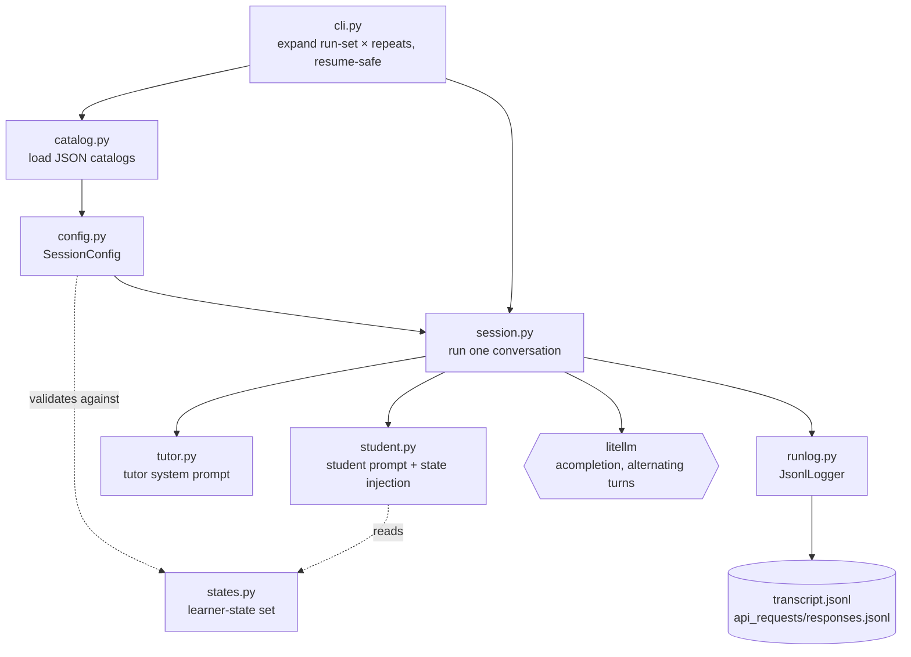

# Tutor/Student Conversation Simulation — Build Spec (state-driven, LearnLM)

Simulates tutoring conversations: a **fixed simulated student**, driven by a per-turn
**learner-state injection**, talks to a **tutor model**. The student is identical for every
tutor so that many tutor models can be compared. **One simulation = one conversation =
one condition × repeat** (see §1), saved as one transcript.

This build is the **simulator** — it produces transcripts. Scoring is **out of scope** here,
but the transcript (see §7) carries the fields the downstream critic/ranking needs (§8).

Models come from **litellm**, so there is no provider layer to build, and no separate model
wrapper module: the session loop calls litellm's async completion directly. A wrapper would
only pay off if it centralized retries/backoff or default params; logging already lives in
the run-logger. Revisit only if shared retry logic actually appears.

> This spec is intentionally prose, not code. It is expected to change; nothing here should
> require rewriting code to keep the spec current.

## Lineage & scope

Based on **Jurenka, Kunesch, McKee et al. (Google DeepMind), arXiv:2407.12687**, "the paper."
Tags like A3 / B1 refer to that paper and its build-mapping notes; `[your design]` marks
anything not from the paper.

This branch **replaces the prior TeachTune student** (arXiv:2410.04078) wholesale. Removed:
the four psychological traits, the *Interpret* step, the bounded-knowledge model
(`can_say` / mastery). Replaced with the LearnLM gen-AI role-play (A2): one fixed student
model driven by a **predefined, fixed per-turn state sequence** (B1). The injected state — not a knowledge bound — controls how the student
behaves each turn (e.g. "frustration" → shows it is tempted to give up; "off-topic" → drifts
from the lesson). The paper publishes no verbatim prompts and names only one state ("make
mistake", A8); the working set is `[your design]`. The context-independent (CI) student keeps
the full set including the correctness states; the context-dependent (CD) student uses a
separate, reduced set (see §3, §4).

---

## 0. Principles

1. **Identical student for every tutor (B1).** Same student model and the same fixed state
   sequence per scenario. This is the comparability requirement and the reason cross-model
   scores (§8) are meaningful.
2. **State controls behavior, not knowledge (A3/B1).** No `can_say`, no mastery gate. The
   per-turn injected state says *how* the student behaves; it realizes that from its own
   latent knowledge, pinned by the topic (CI) or region (CD). Correctness is governed by the
   state, so the student knowing the material does not defeat the simulation.
3. **The tutor receives no privileged state info (B1).** The paper hands the learner's hidden
   state to the tutor only to generate training data; doing so at evaluation time would
   trivialize the dimensions that require the tutor to *infer* what the student is doing (e.g.
   spotting confusion or disengagement). The tutor sees only the student's spoken text and
   must infer.
4. **Headline axes = tutor model × language.** The scenario is the fixed-student container (a
   coverage axis). Tutor prompt variant may vary while getting the design right, but is held
   fixed for the headline runs.
5. **One conversation = one directory**, resume-safe, with explicit repeats.

---

## 1. The experiment — conditions, axes, repeats

A **condition** is one fully-specified configuration: one scenario, one tutor model, one language,
one tutor prompt variant, with the student model and state sequence all fixed.

- **Headline axes:** tutor model × language.
- **Secondary axes** (fixed for the headline comparison, varied only while tuning the design):
  scenario coverage and tutor prompt variant.
- **Repeats.** Because the models are stochastic, each condition is run `repeats` times; each run
  (`r0`, `r1`, …) is an independent draw producing its own transcript. Repeats give a
  distribution per condition instead of a single sample — what the downstream ranking consumes.
  Comparability holds because every repeat of every tutor faces the identical fixed student.

A **run-set** enumerates the conditions (and their repeat counts). The CLI expands it, skips conditions
already on disk, and runs the rest, so adding a model or language only fills the missing conditions.

---

## 2. Components (responsibilities, not code)

- **student** — owns the learner-state set, the per-state strategy text, and assembly of the
  student prompt: a static part (role and framing) plus the dynamic
  injected state for the current turn.
- **tutor** — assembles the tutor prompt: static only, no state injection.
- **catalog / config** — loads the topic catalogs (context-independent and context-dependent),
  regions, languages, and models, and resolves each run-set item into a runnable session.
- **session** — runs one conversation (calling litellm directly) and logs it.
- **run-logger** — JSONL logging of raw API requests/responses plus the transcript (kept from
  the current project).
- **cli** — expands the run-set matrix into conditions × repeats and runs them, resume-safe.

The TeachTune *Interpret* module and the knowledge/mastery catalogs are removed. The package
should be renamed since the method is no longer TeachTune.

The simulator lives in `src/tutoring_check/sim/`:

---

## 3. Scenarios = the existing topic catalogs

Scenarios are the **context-independent (CI)** and **context-dependent (CD)** topics from the
previous version, not new files. This reintroduces **regions** for the CD case.

- **CI topics** — the student is a learner and the tutor teaches the topic. The topic supplies
  a topic name and the tutor's teaching directive / learning goal; the latter encodes what the
  tutor steers toward. The CI "misconception" state has the student improvise a plausible
  misconception itself.
- **CD topics** — the student is learning more about their **own** culture/region, which they
  know only partially: firsthand from lived experience, with gaps in the deeper layer (history,
  meaning, significance). The tutor helps them deepen that understanding — which is why CD has a
  tutor at all. This brings in the **region**, which pins the culture the student speaks from.
  Language may default from the region, overridable per run-set item.

> **CD differs from CI — authored separately.** The CD student lives on two layers: a **lived
> layer** (their own experienced traditions) where they are the authority and cannot be
> "corrected," and a **deeper layer** (history, meaning, significance) where they have gaps and
> can be partly wrong. So CD gets its own state set (communication behaviors plus the learner
> states `knowledge_gap` and `partial_understanding` for the deeper layer), authored apart from
> the CI set; it has no general correctness/mistake states because the lived layer is off-limits
> to correction. The tutor must tell the two layers apart: validate and draw out the lived
> layer, teach the deeper one. Which scored dimensions CD keeps under this framing is revisited
> in §5/§8/§10. CI keeps the full original state set and all dimensions.

---

## 4. Learner states and the injection (A3/B1)

The paper's role-play has two layers per role: a **static** prompt fixed for the whole
conversation, and a **dynamic** prompt that changes each turn — the injection.

- **Static (student):** you are a learner, not an assistant; brief spoken answers; ask
  questions when confused; respond in the run's language. Kept close to the current student
  prompt to limit drift.
- **Dynamic (student):** the strategy for the current learner state — e.g. for "misconception,"
  voice a specific, plausible misconception confidently without signaling it is wrong; for
  "frustration," show the work is hard and you are tempted to give up.
- **State set (CI):** only "make mistake" is paper-confirmed; the rest is extrapolated and
  `[your design]` — opening, correct answer, partial answer, wrong answer, misconception,
  implicit confusion, explicit confusion, disengagement, frustration, correct-without-
  explanation, off-topic. **CD uses a separate, reduced set authored apart** — no
  correctness/mistake states (see §3).
- **Fixed sequence (B1).** For evaluation the sequence is **predefined per scenario and walked
  in order**, one state injected per student turn — not chosen by the model (the paper uses
  model self-selection only for free-form training data) and not adapted to the tutor.
  Conversation length equals the sequence length. This is what makes every tutor face an
  identical student and keeps per-turn scores comparable for the ranking (B4).
- **Localization (B5):** the strategy strings are translated per language; affect-related
  states (frustration, disengagement) are higher-risk and should be reviewed per language.

> Tradeoff recorded: a fixed sequence means the tutor cannot change the student's trajectory,
> so this design cannot measure whether a tutor "rescues" a struggling student. That is the
> deliberate price of cross-model comparability. A reactive variant is possible later but
> breaks the identical-student basis for ranking.

---

## 5. Tutor prompt

Static only — the tutor never receives the learner state (§0.3). Minimal and **identical
across tutor models** for the headline comparison: role, the topic's teaching directive, and
baseline pedagogy reflecting the paper's five principles and pedagogical dimensions
(stay on topic, don't reveal the answer, guide actively, promote engagement,
address mistakes, respond to affect, positive tone, adapt to level), responding in the run's
language. (Tutor turns are scored on the mTeach
framework §8, `evaluation.md`.) For CD the prompt instead frames the tutor as helping the student learn more about
their **own** culture: build on and draw out what the student knows firsthand (the lived layer,
treated as authoritative and never corrected), and teach the deeper layer — history, meaning,
significance — where the student is unsure or partly wrong (§3). The tutor sees only the spoken
conversation; never the state labels.

Prompt variant is a secondary knob, fixed for the headline runs.

---

## 6. The conversation loop

The tutor speaks first, opening from its teaching directive. Then for each state in the
scenario's fixed sequence: the student responds with the current state injected into its
dynamic prompt, and the spoken turn plus its state label are stored; then the tutor responds
to the next student turn, seeing only the spoken text so far (state labels stripped). The
student conditions on the full history including the tutor's turns — it reacts to what the
tutor said, while the injected state pins *how* it reacts. Comparability comes from the fixed
student model + params + state sequence + seed, not from identical wording.

Turn order is **tutor-first**, fixed across the campaign: with no "opening" student state, the
tutor opens the lesson and each student turn carries one state from the sequence.

---

## 7. Output and transcript

One directory per condition × repeat, resume-safe; a condition whose transcript already exists is
skipped. Each transcript records: scenario id, scenario type (CI/CD) and region, language,
tutor model and prompt variant, student model and params, the seed, and the ordered turns —
each with a turn id, speaker, spoken text, and (on student turns) the stored state label —
plus a creation timestamp. These fields are chosen so the downstream critic and ranking (§8)
can reconstruct any comparison.

> Determinism note: with temperature > 0 the wording varies per run; the seed pins the state
> *trajectory*, not the text. That is why conditions carry an explicit repeat index — repeats give
> the distribution the ranking consumes.

---

## 8. Build order

1. student — state set, per-state strategy text, static/dynamic prompt assembly; validate the
   scenario's state strings against the known set.
2. tutor — static, minimal, model-identical prompt with no state injection.
3. session — one full conversation; verify the state label is stored but absent from what the
   tutor saw.
4. catalog / cli — load topic catalogs + regions + languages + models, expand the run-set into
   conditions × repeats, resume-safe.

Ship a context-independent topic in English with one tutor model first; more models, languages,
and topics are catalog entries.

---

## 9. Open questions

- Per-language localization of the strategy strings (§4).
- Exact CI working state set beyond the paper-confirmed "make mistake"; CD state set is
  authored separately (§3–§4).

---

## 10. Fidelity / design checklist

- [ ] Student = fixed model + per-turn state injection (A3/B1); no traits, Interpret, or `can_say`.
- [ ] State sequence fixed per scenario; identical student for every tutor (B1).
- [ ] State injected into the student only; stored, hidden from the tutor (B1).
- [ ] Tutor prompt minimal and identical across tutor models; reflects the paper's five
      principles / pedagogical dimensions (scoring is mTeach — §8, `evaluation.md`).
- [ ] Headline axes = tutor model × language; prompt variant fixed for headline runs.
- [ ] Scenarios are the existing CI/CD topics; region reintroduced for CD.
- [ ] Multi-turn, scenario-guided; correctness is state-controlled, not knowledge-bounded.
- [ ] Student model + params + seed fixed and recorded; repeats supported.
- [ ] Transcript carries scenario id/type/region, state, language, model id for downstream
      scoring/ranking; no surface-overlap metrics.
