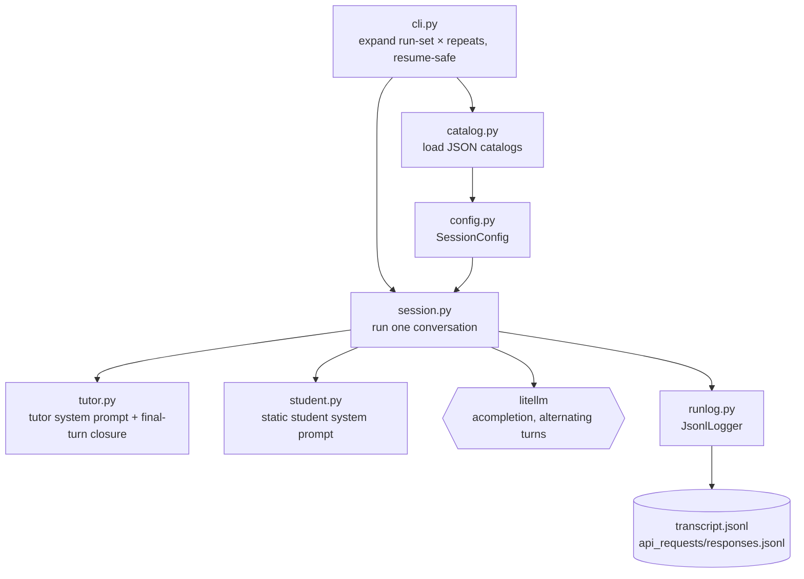

# Tutor/Student Conversation Simulation — Build Spec (LearnLM)

Simulates tutoring conversations: a **fixed simulated student** talks to a **tutor model**.
The student is identical for every tutor so that many tutor models can be compared.
**One simulation = one conversation = one condition × repeat** (see §1), saved as one transcript.

This build is the **simulator**, which produces transcripts. Scoring is **out of scope** here,
but the transcript (see §7) carries the fields the downstream critic/ranking needs (§8).

Models come from **litellm**, so there is no provider layer to build, and no separate model
wrapper module: the session loop calls litellm's async completion directly. A wrapper would
only pay off if it centralized retries/backoff or default params; logging already lives in
the run-logger. Revisit only if shared retry logic actually appears.

---

## 0. Principles

1. **Identical student for every tutor (B1).** Same student model and the same static student
   prompt for every run. This is the comparability requirement and the reason cross-model
   scores (§8) are meaningful.
2. **The student behaves from a fixed role (A3/B1).**
3. **Headline axes = tutor model × language.** The scenario is the fixed-student container (a
   coverage axis). Tutor prompt variant may vary while getting the design right, but is held
   fixed for the headline runs.
4. **One conversation = one directory**, resume-safe, with explicit repeats.

---

## 1. The experiment: conditions, axes, repeats

A **condition** is one fully-specified configuration: one scenario, one tutor model, one language,
one tutor prompt variant, with the student model fixed.

- **Headline axes:** tutor model × language.
- **Repeats.** Because the models are stochastic, each condition is run `repeats` times; each run
  (`r0`, `r1`, …) is an independent draw producing its own transcript. Repeats give a
  distribution per condition instead of a single sample, what the downstream ranking consumes.
  Comparability holds because every repeat of every tutor faces the identical fixed student.

A **run-set** enumerates the conditions (and their repeat counts). The CLI expands it, skips conditions
already on disk, and runs the rest, so adding a model or language only fills the missing conditions.

The default `data/run_set.json` declares the shared `defaults` (models, reasoning, language, `repeats`), a list of `topics`, and a `pedagogy_sweep` — and `load_run_set` expands the cross-product into cells. The sweep fixes exactly one approach at each `extreme` (Very High / Very Low)
with the rest at `baseline` (Neutral), giving `topics × approaches × extremes` cells with ids like
`gravity-en-ce-vh`. An explicit `items` list is still accepted for one-off run-sets (used by the CD
copies under `runs/`).

---

## 2. Components (responsibilities, not code)

- **student** — assembles the student prompt: a single static prompt (role, learner framing,
  the topic's opening problem, response style) fixed for the whole conversation.
- **tutor** — assembles the tutor prompt: a static system prompt, plus a closure instruction
  appended onto the final tutor turn only (§5).
- **catalog / config** — loads the topic catalogs (context-independent and context-dependent),
  regions, languages, and models, and resolves each run-set item into a runnable session.
- **session** — runs one conversation (calling litellm directly) and logs it.
- **run-logger** — JSONL logging of raw API requests/responses plus the transcript (kept from
  the current project).
- **cli** — expands the run-set matrix into conditions × repeats and runs them, resume-safe.

The simulator lives in `src/tutoring_check/simulation/`:

---

## 3. Scenarios = the existing topic catalogs

Scenarios are the **context-independent (CI)** and **context-dependent (CD)** topics from the
previous version, not new files. This reintroduces **regions** for the CD case.

- **CI topics** — the student is a learner and the tutor teaches the topic. The topic supplies
  a topic name and the tutor's opening problem / learning goal.
- **CD topics** — the topic concerns the student's **own** culture/region; the region pins the
  culture the student speaks from, and language may default from the region, overridable per
  run-set item.

The CI/CD distinction is currently a **scenario/catalog axis** — it selects the topic catalog,
the `scenario_type` recorded in the transcript, and (for CD) the region. The student and tutor
system prompts themselves are single static prompts that do not branch on it. Reintroducing a
CD-specific prompt framing (validate the lived layer, teach the deeper one) is a possible
future refinement, tracked in §9.

---

## 4. The conversation length

The conversation is a **fixed number of turns per speaker** (a constant in `session.py`),
tutor-first and strictly alternating, so every tutor faces the same conversation shape. There
is no per-turn state sequence and no model self-selection of behavior: the student simply
reacts to the tutor from its static role each turn.

- **Static student prompt:** a 7th-grade learner who does not understand the topic; brief,
  casual spoken answers; asks questions when confused; builds on prior explanations; responds
  in the run's language. Kept close to the reference student prompt to limit drift.
- **Localization (B5):** the prompt is issued in the run's language.

---

## 5. Tutor prompt

A static system prompt, **identical across tutor models** for the headline comparison: the
tutor's role, the assigned pedagogical-approach levels, the topic's opening problem, and the
response requirements. On the **final tutor turn only**, a closure instruction is appended onto
the last message at the generation point (asking the tutor to provide clear closure), so the
conversation ends with a wrap-up. The tutor sees only the spoken conversation.

---

## 6. The conversation loop

The tutor speaks first, opening from its instructions by posing the topic's problem. Then, for
a fixed number of iterations, the student responds (seeing the full history including the
tutor's turns and reacting to what the tutor said), and the tutor responds to the next student
turn, seeing only the spoken text so far. On the final iteration the tutor turn carries the
appended closure instruction (§5). Comparability comes from the fixed student model + params +
seed, not from identical wording.

Turn order is **tutor-first**, fixed across the campaign: the tutor opens the lesson and the two
speakers alternate for the fixed length.

---

## 7. Output and transcript

One directory per condition × repeat, resume-safe; a condition whose transcript already exists is
skipped. Each transcript records: scenario id, scenario type (CI/CD) and region, language,
tutor model and prompt variant, student model and params, and the ordered turns (each with a
turn id, speaker, and spoken text) plus a creation timestamp. These fields are chosen so the
downstream critic and ranking (§8) can reconstruct any comparison.

---

## 8. Fidelity / design checklist

- [ ] Student = fixed model + single static prompt (A3/B1).
- [ ] Identical student for every tutor (B1).
- [ ] Tutor prompt minimal and identical across tutor models; final-turn closure appended.
- [ ] Headline axes = tutor model × language; prompt variant fixed for headline runs.
- [ ] Scenarios are the existing CI/CD topics; region reintroduced for CD.
- [ ] Multi-turn, fixed-length, tutor-first; the tutor sees only spoken text.
- [ ] Student model + params + seed fixed and recorded; repeats supported.
- [ ] Transcript carries scenario id/type/region, language, model id for downstream
      scoring/ranking; no surface-overlap metrics.
