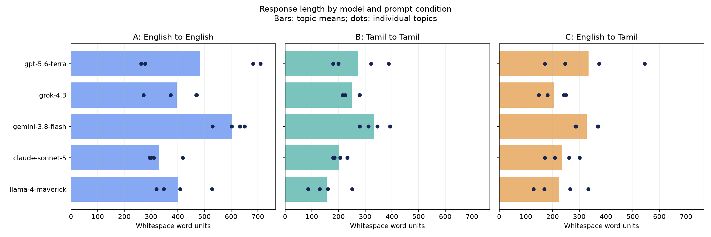

# Length comparison

60 responses; 20 matched model/topic groups.

A = English prompt / English output; B = Tamil prompt / Tamil output; C = English prompt / Tamil output.

## Mean word units per response

| Model | A | B | C | B vs C |
|---|---:|---:|---:|---:|
| gpt-5.6-terra | 483.2 | 272.5 | 334.2 | -11.8% |
| grok-4.3 | 396.2 | 249.8 | 205.2 | +26.8% |
| gemini-3.8-flash | 604.0 | 332.8 | 328.0 | +1.7% |
| claude-sonnet-5 | 330.8 | 201.2 | 235.5 | -11.0% |
| llama-4-maverick | 401.2 | 156.8 | 224.5 | -25.3% |

B vs C is the mean of topic-matched percentage changes, using C as the denominator.

## Measurement definitions and limits

- Word units: whitespace-separated units containing at least one Unicode letter or number. Standalone Markdown separators and symbols are excluded. This is a reproducible length proxy, not linguistic word segmentation.
- Characters: Unicode code points after NFC normalization, including spaces and Markdown.
- Graphemes: non-whitespace Unicode extended grapheme clusters after NFC normalization; a better approximation of displayed characters than code points for Tamil.
- Response Markdown, equations, headings, and tables are retained. LaTeX commands and formatting can affect counts; these are source-text length measures, not rendered prose counts.
- Output tokens are provider-reported usage and may include reasoning tokens; they are not a comparable visible-length metric across providers or languages.
- B versus C keeps the requested output language Tamil and is the most direct prompt-language comparison. A versus B/C also changes output language and its morphology.
- Four topics and one generation per condition provide descriptive results only. Length does not establish accuracy, coverage, or teaching quality.

## Data

[Per-response measurements](response_lengths.csv) · [Model summaries](model_summary.csv) · [Topic-matched differences](paired_differences.csv)
